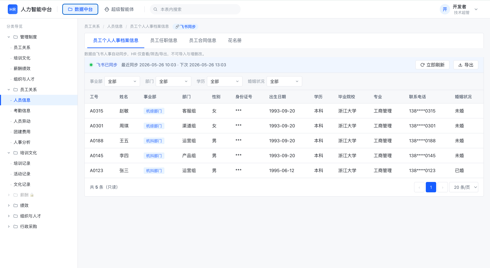
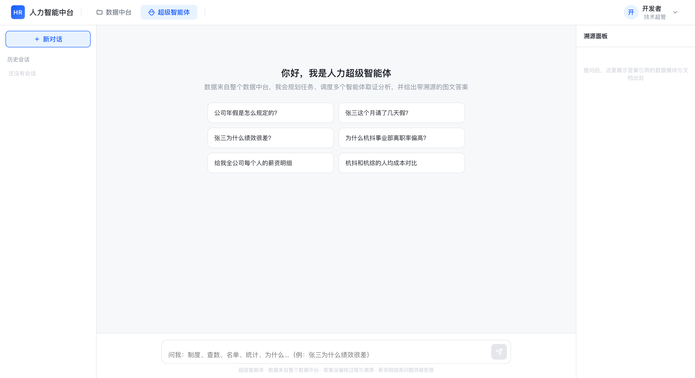
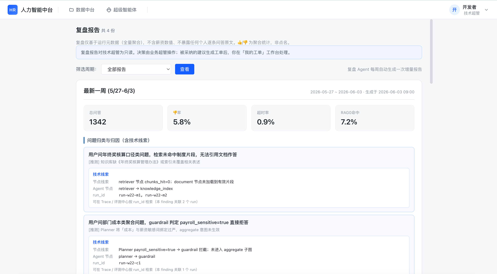
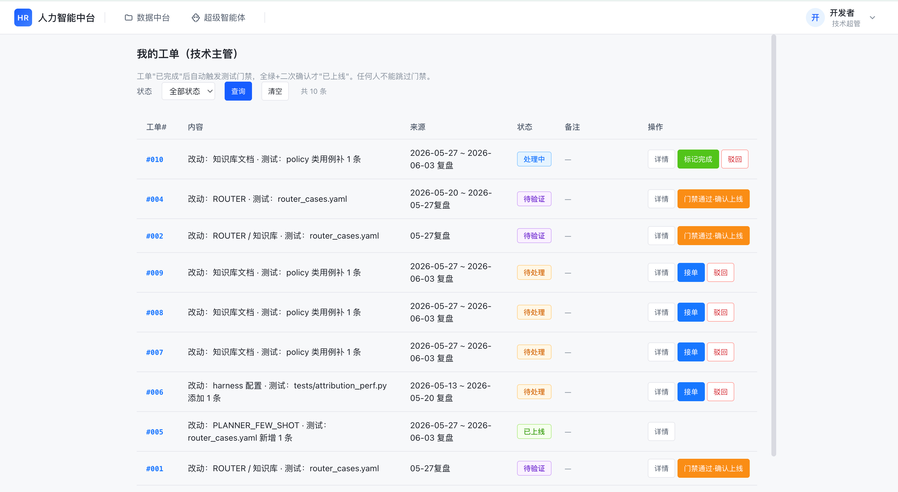
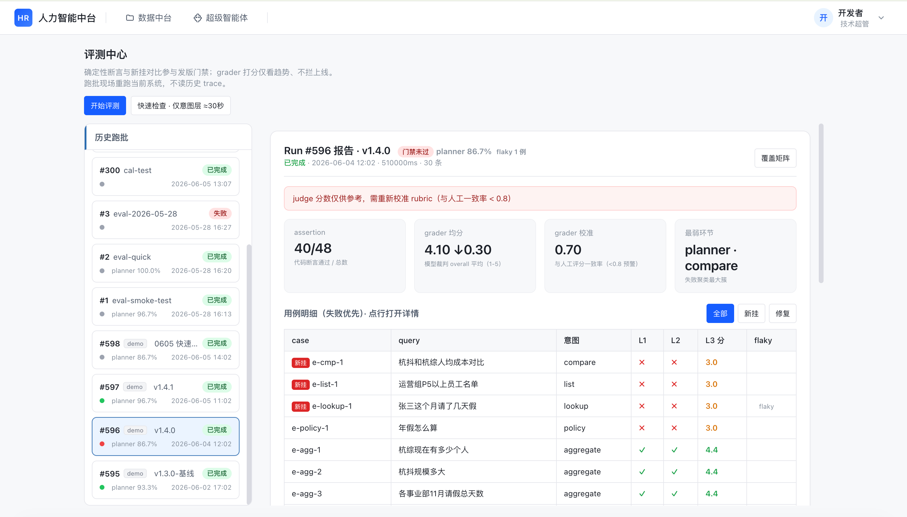

# hr-intelligence-platform

> A multi-agent LLM system that dares to run in "production shape" for HR — a domain where wrong answers cost money and a leaked salary is an incident. So governance is the main character here: every run is traced, a weekly retrospective hunts bad cases, every fix must pass a test gate, and even the eval judge gets calibrated. **The AI keeps getting smarter, but every change is human-approved, gate-blocked, and auditable.**

[](./LICENSE)
[](https://www.python.org/downloads/)
[](https://github.com/langchain-ai/langgraph)
[](https://tongyi.aliyun.com)

**English | [中文版](./README.zh-CN.md)**

---

## What it is

Three things bolted together: an HR data platform (84 categories — roster, attendance, payroll, performance, headcount…), a multi-agent Q&A pipeline ("why is attrition up in BU-A?" goes in; an answer with citations, metric definitions and stated caveats comes out), and a full governance loop wrapped around both.

The main chain:

```
question
   ↓
Planner (semantic planning)   ←─ Critic sends weak cases back (≤2×)
   ↓
Supervisor (deterministic dispatch)
   ├─ Resolver        entity resolution
   ├─ Retriever       parallel multi-table fetch (Send fan-out)
   └─ Document RAG    policy retrieval
   ↓
Analyst
   ↓
Critic ── evidence weak → back to Planner | evidence OK ↓
   ↓
Composer (citations + metric definitions + caveats)
   ↓
answer + full trace
```

Around it, the governance loop: **trace → weekly retrospective clusters failures → humans decide → tickets → test gate → eval baseline refresh.** Machines surface problems, humans call the shots, gates hold the line.

## Features

- **🧠 Flexible judgment, rigid execution**: intent, entities and payroll sensitivity are judged semantically by the LLM (zero keyword enumeration); which path runs, which table is queried, who sees what — all deterministic code. Same plan, same path, every time
- **🔁 A quality-check loop**: the Critic verifies evidence sufficiency and sends weak cases back for replanning (max 2×); if evidence stays thin, the answer says so explicitly — **admit, don't fabricate**
- **⚡ Parallel fan-out**: three tables needed? LangGraph `Send` spawns three workers — isolated sessions, per-worker masking, one failure never sinks the batch
- **🧾 RAG that refuses to make things up**: hybrid retrieval + rerank over policy docs, current versions only, citations mandatory; on zero hits the correct answer is "no such rule found"
- **🔒 Defense-in-depth payroll**: business admins see figures with a 30-min TTL re-confirmation and full audit; staff are blocked at intent classification; **the tech admin never sees a salary figure even with full system access**; the LLM never knows the user's role, so identity-spoofing prompt injection has nothing to grab
- **🧮 LLM interprets, code computes**: every number in an answer comes from deterministic code or the calc tool — "the model did the math wrong" is not a bug class here
- **🧪 An eval center** where assertions are visible and the judge can be challenged (details below)
- **🚧 Test gate as a hard rule**: nobody ships past a red gate — not even the tech admin; enforced in the backend, not just the UI

## Screenshots











*All entities in screenshots are mock data.*

## The Eval Center: visible assertions, a challengeable judge

Most projects' eval is "run a score, hang it on a page". This one answers four working questions:

**Which stage broke?** Intent correctness (L1) and retrieval hits (L2) are deterministic, code-checked assertions — open any case and *expected vs. actual* sit side by side; where it failed is obvious at a glance.

**Why did the judge give this score?** Final answers are scored by an LLM-as-judge on four dimensions (correctness / completeness / citation / compliance), with its full grading basis on display: reference answer points, red lines, metric requirements, per-dimension reasoning, violations. Think it judged wrong? Hit *disagree* with your own score — once 20 samples accumulate, the system computes **judge-vs-human agreement** and warns on the page when it drops below 0.8: "judge scores are advisory only."

**Did my change help?** Every run is auto-diffed against the previous one: **regressed** (passed before, fails now — you broke something) and **fixed** (failed before, passes now — the work landed) listed separately. Totals cancel out and lie; flows don't.

**Is the exam paper complete?** A coverage matrix (intent × layer case counts, zeros flagged red) plus a checklist of cases still missing their answer key.

The gating rule in one line: **deterministic things block (assertions, planner accuracy, regressions); fuzzy things observe (judge scores are trend-only)** — a fuzzy number never gets to be a gate.

Ships with one-click-resettable demo data telling a full storyline: healthy baseline → a release blocked by the gate for regressions → fixed and passing.

## Three roles

| Role | Does what | Payroll figures |
|---|---|---|
| **Business admin (HRD)** | Decides on retrospective findings; reads plain-language summaries | ✅ Visible, 30-min TTL re-confirmation + full audit |
| **Tech admin** | Builds and operates the system; handles tickets | ❌ Never visible (defense in depth against "privileged user bypasses the frontend") |
| **Staff** | Day-to-day operational data | ❌ Blocked at intent layer, fields masked, category hidden |

Same findings, two renderings: plain business language for the business admin; phenomenon / root-cause hypothesis / node clues / evidence run IDs for the tech admin.

## Quick start

```bash
# 1. Clone
git clone https://github.com/Danyangkk/hr-intelligence-platform.git
cd hr-intelligence-platform

# 2. Configure
cp .env.example .env
# set three things: Qwen API key, JWT secret, Postgres password

# 3. Eight services, one command
docker compose up --build

# 4. Open
# Frontend   http://localhost:8080
# API docs   http://localhost:8080/api/v1/docs
```

## Repository layout

```
├── backend/
│   ├── src/agent/            # LangGraph orchestration: 7 agents, 19 skills, 8 tools, router
│   ├── src/services/         # RAG, RBAC, audit, retrospective, eval, Feishu sync
│   ├── src/eval/             # Eval runner: L1/L2 assertions + L3 LLM-as-judge
│   ├── eval/eval_set.yaml    # The exam paper: cases + expectations (changes go through git review)
│   └── tests/                # Offline regression gate (pytest -m "not online")
├── pycore/                   # Self-built lightweight framework (via PYTHONPATH)
├── frontend/                 # Single-file vanilla HTML/JS app
├── docs/                     # Design docs, refactor plans, README screenshots
└── docker-compose.yml        # postgres(pgvector) · redis · minio · api · celery — the full eight
```

## Design philosophy

- **Semantic work goes to the model; deterministic work goes to code** — the same principle repeats at every layer: routing, permissions, computation, evaluation
- **The keyword safety net can only tighten, never loosen** — LLM says "not sensitive" but a payroll keyword fires? Treated as sensitive
- **The retrospective agent never auto-fixes** — it surfaces findings; humans decide; gates enforce
- **Audit everything that touches sensitive data; log nothing sensitive itself** — record *who looked at whose record and why*, never the salary figure
- **The judge is not trusted by default** — basis transparent, verdicts challengeable, agreement with humans continuously measured

## Roadmap

In progress (plans in `docs/REFACTOR_PLAN_agent_flexibility.md` and `docs/EVAL_PLAN_assertion_grader.md`):

- **Catalog-driven table selection**: the 84-category catalog injected into the Planner replaces memorized few-shots — adding a table = inserting one record, the agent just sees it
- **Hybrid evidence**: structured + RAG retrieval in a single plan, to handle "why is attrition up — is the new review policy involved?"
- **Stage-level assertions**: eval sampling across all six pipeline stages (incl. Resolver entities, Analyst numbers, Critic behavior)
- **Two-tier skill disclosure**: a one-line index of all skills + full text only for the 1–2 the current step needs — no more truncated SOPs

## Status

A portfolio-grade project: the framework is production-shaped (permissions, audit, trace, gate, calibrated eval) and the data is mock. The full improvement loop runs end-to-end on mock data.

## License

MIT — see [LICENSE](./LICENSE).

## Author

**Danyang** · 18346103232@163.com

---

*The question this project explores: what does an AI agent system look like when it has to be governed, audited and continuously improved — not just demoed.*
