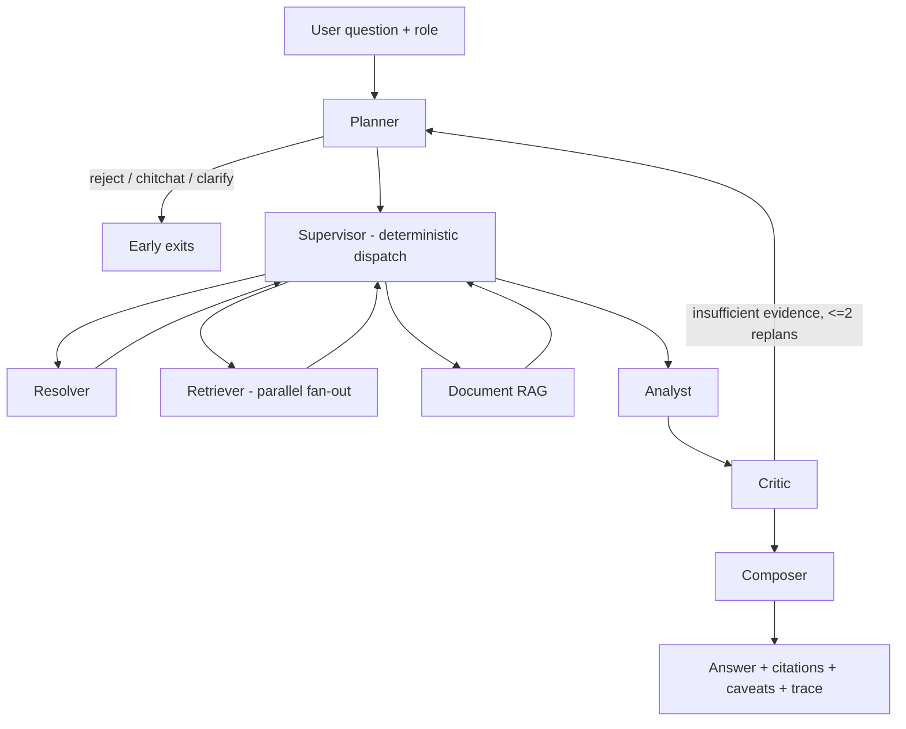

# hr-intelligence-platform

**English | [中文版](./README.zh-CN.md)**

An HR data platform + multi-agent intelligence system, built around one hard question: **how do you run an LLM agent in production — in a domain where wrong answers cost money and leaked salaries are incidents — and let it keep getting smarter without losing control?**

The answer this project gives: semantic flexibility where the LLM judges, deterministic rigor where the system executes, and a full governance loop (trace → retrospective → tickets → test gate → eval baseline) around everything.

## Why this project

Most agent demos stop at "it can answer". This one treats the unglamorous parts as the main event: permissions with defense in depth, audit trails, reproducible traces, regression gates, and an evaluation system whose judge is itself audited and calibrated.

## Screenshots


*All entities in screenshots are mock data.*

## Key features

**1. HR Data Platform**
- 84 L3 data categories across 4 source types (Feishu sync, manual upload, rules, reports)
- Three fixed business units; consistent dimension across the whole system
- File parsing (SheetJS), data preview, lineage

**2. Multi-agent System (LangGraph)**
- Planner (semantic routing, no keyword enumeration) + Supervisor (deterministic dispatch)
- 5 reusable agents: Resolver, Retriever, Analyst, Composer, Critic — with a quality-check loop: the Critic verifies evidence sufficiency and can trigger up to 2 replans, or force a stated-limitation answer instead of fabricating
- Parallel fan-out for multi-table retrieval (LangGraph `Send`), per-worker isolation and soft degradation
- Extensible Skills (11 general + 8 process SOPs) and 8 deterministic Tools; LLM interprets, code computes
- RAG over policy docs (Qwen embedding + hybrid retrieval + rerank); refuses to fabricate when 0-hit

**3. Evaluation Center — assertions you can see, a judge you can challenge**
- **Deterministic assertions** (code-checked, binary): intent accuracy (L1) and retrieval hit (L2), per-case *expected vs. actual* shown side by side in a drill-down modal
- **LLM-as-judge** (L3) scores answers on a 4-dimension rubric (correctness, completeness, citation, compliance) — and shows its full grading basis: reference answer points, red lines, metric callouts, reasoning, violations
- **Judge calibration**: humans agree/disagree with each verdict (with their own score); consistency vs. human labels is computed once ≥20 samples accumulate, and the UI warns when the judge drifts below 0.8
- **Release gate + regression diff**: planner accuracy threshold gates releases; every run is diffed against the previous one into *regressed* / *fixed* lists — totals can hide offsetting changes, flows can't
- **Coverage matrix**: intent × layer case counts plus an expected-field completeness checklist — "which scenarios have no exam questions, and which questions have no answer key"
- **Repeatable demo data**: seeded runs tell a baseline → regression-blocked → fixed storyline, resettable in one click

**4. Production-grade Governance Harness**
- **Trace** every run with node-level decisions, SOP steps, tool calls, status (no sensitive originals; queries hashed)
- **Auto-retrospective agent** (weekly) clusters bad cases into findings with dual-layer output: business summary for decisions, technical detail for execution
- **Improvement ticket workflow** with source lineage and a status machine gated by tests; auto-rollback on gate failure
- **Test gate (CI)** as a hard rule: nobody — not even the tech admin — can ship past a red gate

**5. Role-separated Governance & Safety (3 roles)**
- **Business admin (HRD)**: owns payroll access — job-bound, 30-min TTL re-confirmation per action, fully audited
- **Tech admin**: builds and operates the system; *never* sees payroll figures even with system access (defense in depth)
- **Staff**: payroll permanently isolated — rejected at intent classification, fields masked, category hidden
- LLM judges semantic sensitivity; Python decides permissions; the keyword safety net can only tighten, never loosen

## Architecture



Around this chain sits the governance loop: every run leaves a trace → weekly retrospective clusters failures into findings → humans decide → tickets → test gate → eval baseline refresh.

## Tech stack

Python 3.11 · FastAPI · LangGraph · SQLAlchemy + Alembic · PostgreSQL + pgvector · Redis · Celery · MinIO · Qwen (chat + embedding + judge) · Feishu Open Platform · Docker Compose · pytest (offline regression gate) · vanilla HTML/JS frontend · self-built PyCore framework (via PYTHONPATH)

## Repository layout

```
├── backend/
│   ├── src/agent/            # LangGraph orchestration, agents, skills, tools, router
│   ├── src/services/         # RAG, RBAC, audit, retrospective, eval, Feishu sync
│   ├── src/eval/             # Eval runner: L1/L2 assertions + L3 LLM-as-judge
│   ├── src/models/           # SQLAlchemy models (incl. eval runs, feedback)
│   ├── eval/eval_set.yaml    # The exam paper: cases with expected blocks (git-reviewed)
│   └── tests/                # Offline regression gate (pytest -m "not online")
├── pycore/                   # Self-built lightweight framework
├── frontend/                 # Single-file vanilla HTML/JS app
├── docs/                     # Design documents & refactor plans
│   └── screenshots/          # README screenshots
└── docker-compose.yml        # 8 services, one command
```

## Quick start

```bash
# 1. Clone
git clone https://github.com/Danyangkk/hr-intelligence-platform.git
cd hr-intelligence-platform

# 2. Configure env
cp .env.example .env
# edit to set: Qwen API key, JWT secret, Postgres password

# 3. Run
docker compose up --build

# 4. Open
# Frontend: http://localhost:8080
# Backend API docs: http://localhost:8080/api/v1/docs
```

## Design philosophy

One principle runs through every layer — **flexibility in judgment, rigor in execution**:

- **Semantic routing, no keyword enumeration.** Intent classification is done by LLM; keywords remain only as a fail-closed safety net that can tighten but never loosen.
- **LLM interprets, code computes.** Every number in an answer comes from deterministic code or the calc tool — there is no "the model did the math wrong" class of bug.
- **Deterministic checks gate; fuzzy scores observe.** Assertions, planner accuracy and regression diffs can block a release; the judge's scores only show trends — a fuzzy number is never a gate.
- **The judge is not trusted by default.** Its grading basis is fully visible, every verdict can be challenged, and its agreement with humans is measured.
- **Job-bound permissions, defense in depth.** Payroll decisions live in Python, pre-gated before any routing; the LLM never sees roles.
- **The retrospective agent does not auto-fix.** It surfaces findings; humans decide; gates enforce.
- **Audit everything that touches sensitive data, log nothing sensitive itself.**

## Roadmap

In progress (see `docs/REFACTOR_PLAN_agent_flexibility.md` and `docs/EVAL_PLAN_assertion_grader.md`):

- **Catalog-driven planning**: the 84-category catalog injected into the Planner, replacing few-shot table knowledge; invariant-based plan validation with whitelist checks
- **Hybrid evidence**: structured + RAG retrieval in one plan, for questions like "why is attrition up — is the new review policy involved?"
- **Stage-based assertions**: per-node eval sampling across all six pipeline stages
- **Two-tier skill disclosure**: full-text injection only for the skills the current subtask needs

## Status

A portfolio-grade project: the framework is production-shaped (permissions, audit, harness, gate, eval with judge calibration) and the data is mock. The full improvement loop is operational end-to-end on mock data.

## License

MIT — see [LICENSE](./LICENSE).

## Author

**Danyang** · 18346103232@163.com

---

*Built as an exploration of what a production-grade AI agent system looks like when it has to be governed, audited, and continuously improved — not just demoed.*
