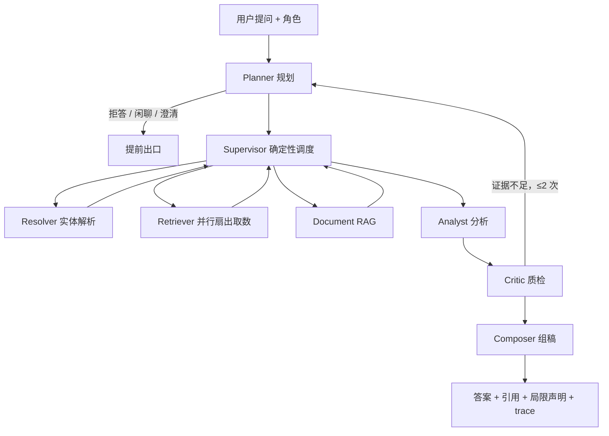

# hr-intelligence-platform（人力智能中台）

**[English](./README.md) | 中文版**

一个 HR 数据平台 + 多 Agent 智能系统，围绕一个难题构建：**在"答错要赔钱、泄露薪资是事故"的领域里，如何让 LLM 智能体跑在生产环境中，并且持续变聪明而不失控？**

这个项目给出的回答是：语义判断交给 LLM 的柔性，执行与校验交给确定性代码的刚性，外加一整圈治理闭环（trace → 复盘 → 工单 → 测试门禁 → 评测基线）。

## 为什么做这个项目

大多数 Agent 演示止步于"能回答"。这个项目把那些不性感的部分当成主角：纵深防御的权限、审计日志、可复现的 trace、回归门禁，以及一套"裁判本身也被审计和校准"的评测体系。

## 截图


*截图中所有实体均为模拟数据。*

## 核心特性

**1. HR 数据中台**
- 84 个 L3 数据分类，覆盖 4 种来源（飞书同步、人工上传、规则、报表）
- 三个固定事业部，全系统统一维度
- 文件解析（SheetJS）、数据预览、血缘

**2. 多 Agent 系统（LangGraph）**
- Planner 语义路由（不靠关键词枚举）+ Supervisor 确定性调度
- 五个可复用 Agent：Resolver、Retriever、Analyst、Composer、Critic——带质检回路：Critic 核验证据充分性，可触发最多 2 次 replan，证据始终不足时输出带局限声明的答案而非编造
- 多表取数 LangGraph `Send` 并行扇出，worker 级隔离与软降级
- 可扩展 Skills（11 个通用方法论 + 8 个业务流程 SOP）与 8 个确定性 Tools；LLM 负责解读，代码负责计算
- 制度文档 RAG（Qwen embedding + 混合检索 + rerank）；零命中时拒绝编造

**3. 评测中心——看得见的断言，可质疑的裁判**
- **确定性断言**（代码判定、二值）：意图准确（L1）与检索命中（L2），每条用例的*期望 vs 实际*在详情弹窗中左右并排展示
- **LLM-as-judge**（L3）按四维 rubric 打分（正确性、完整性、引用、合规），且评判依据全透明：标准答案要点、红线、口径要求、评分理由、违规项
- **裁判校准**：人工对每次评分表态（同意/不同意 + 人工分），样本满 20 条后计算人机一致率，低于 0.8 页面预警"裁判分数仅供参考"
- **发版门禁 + 回归对比**：planner 准确率阈值参与门禁；每次跑批与上次自动 diff 出*新挂 / 修复*清单——总数会互相抵消，流量不会
- **覆盖矩阵**：意图 × 层的用例计数 + expected 字段完备度清单——"哪些场景没出题、哪些题没配标准答案"，一眼看清
- **可重复演示数据**：种子数据构成"基线 → 回归被拦 → 修复"完整剧情，一键重置

**4. 生产级治理装置**
- **Trace**：每次运行的节点级决策、SOP 步骤、工具调用全量落库（不存敏感原文，查询哈希化）
- **自动复盘 Agent**（每周）：坏例聚类成 findings，双层呈现——业务摘要供决策、技术细节供执行
- **改进工单流**：带来源血缘的状态机，发布前必须过测试门禁，门禁失败自动回滚
- **测试门禁（CI）硬规则**：任何人——包括技术超管——都不能带着红灯发版

**5. 角色分离的治理与安全（三档角色）**
- **业务超管（HRD）**：薪资查看权随岗位绑定，每次操作 30 分钟 TTL 二次确认，全程审计
- **技术超管**：建设和运维系统，但*即使拥有系统权限也永远看不到薪资数字*（纵深防御）
- **普通员工**：薪资永久隔离——意图分类层即拒、字段脱敏、分类隐藏
- LLM 判语义敏感性，Python 做权限决策；关键词安全网只能更严、不能放行

## 架构



主链路之外是治理闭环：每次运行留 trace → 周度复盘聚类坏例 → 人工决策 → 工单 → 测试门禁 → 评测基线更新。

## 技术栈

Python 3.11 · FastAPI · LangGraph · SQLAlchemy + Alembic · PostgreSQL + pgvector · Redis · Celery · MinIO · Qwen（对话 + embedding + 裁判）· 飞书开放平台 · Docker Compose · pytest（离线回归门禁）· 原生 HTML/JS 前端 · 自研 PyCore 框架（PYTHONPATH 引入）

## 仓库结构

```
├── backend/
│   ├── src/agent/            # LangGraph 编排、agents、skills、tools、路由总纲
│   ├── src/services/         # RAG、RBAC、审计、复盘、评测、飞书同步
│   ├── src/eval/             # 评测执行器：L1/L2 断言 + L3 LLM-as-judge
│   ├── src/models/           # SQLAlchemy 模型（含评测 run 与人工反馈）
│   ├── eval/eval_set.yaml    # "考卷"：带 expected 块的评测用例（走 git review）
│   └── tests/                # 离线回归门禁（pytest -m "not online"）
├── pycore/                   # 自研轻量框架
├── frontend/                 # 单文件原生 HTML/JS 前端
├── docs/                     # 设计文档与改造方案
│   └── screenshots/          # README 截图
└── docker-compose.yml        # 八个服务一键拉起
```

## 快速启动

```bash
# 1. 克隆
git clone https://github.com/Danyangkk/hr-intelligence-platform.git
cd hr-intelligence-platform

# 2. 配置环境变量
cp .env.example .env
# 填写：Qwen API key、JWT secret、Postgres 密码

# 3. 启动
docker compose up --build

# 4. 访问
# 前端：http://localhost:8080
# 后端 API 文档：http://localhost:8080/api/v1/docs
```

## 设计哲学

一条原则贯穿每一层——**柔性在判断，刚性在执行**：

- **语义路由，不靠关键词枚举。**意图分类由 LLM 语义判断；关键词只作为"只严不松"的安全网保留。
- **LLM 解读，代码计算。**答案里的每个数字都来自确定性代码或 calc 工具——不存在"模型口算错了"这类坏例。
- **确定性的拦，模糊的看。**断言、planner 准确率、新挂对比可以拦发版；裁判的分数只看趋势——模糊数字永远不配当门禁。
- **裁判默认不被信任。**评判依据全透明、每次裁决可被质疑、与人类的一致率被持续测量。
- **权限随岗位绑定，纵深防御。**薪资决策在 Python 层、前置于一切路由分支；LLM 全程不感知角色。
- **复盘 Agent 不自动修复。**机器发现问题，人来决策，门禁来执行。
- **审计一切触碰敏感数据的行为，但绝不记录敏感数据本身。**

## 路线图

进行中（详见 `docs/REFACTOR_PLAN_agent_flexibility.md` 与 `docs/EVAL_PLAN_assertion_grader.md`）：

- **目录驱动的取证规划**：84 类目录注入 Planner，替代 few-shot 表知识；不变式 + 白名单的计划校验
- **混合取证**：一个计划同时包含结构化与 RAG 取证——支持"离职率为什么涨，和新考核制度有关吗"这类问题
- **节点级断言**：评测采样点扩展到全部六个流水线环节
- **Skill 两级披露**：仅向当前子任务注入所需 skill 的全文

## 状态

作品集级项目：框架按生产形态构建（权限、审计、harness、门禁、带裁判校准的评测），数据为模拟数据。完整的改进闭环已在模拟数据上端到端跑通。

## 许可证

MIT — 见 [LICENSE](./LICENSE)。

## 作者

**Danyang** · 18346103232@163.com

---

*这个项目探索的是：当一个 AI Agent 系统必须被治理、被审计、被持续改进——而不只是被演示——它应该长什么样。*
